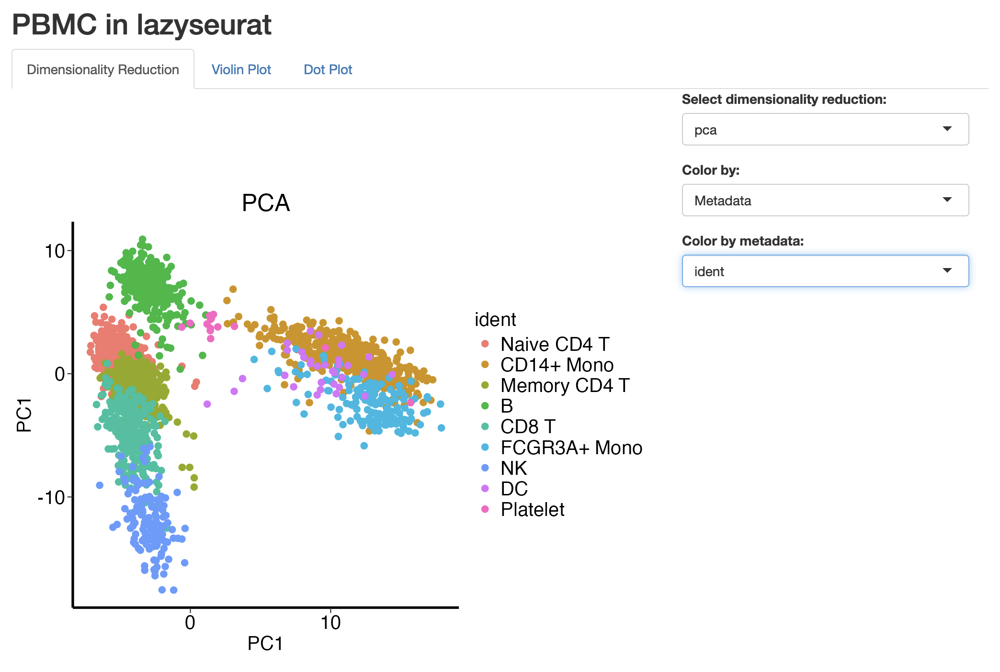
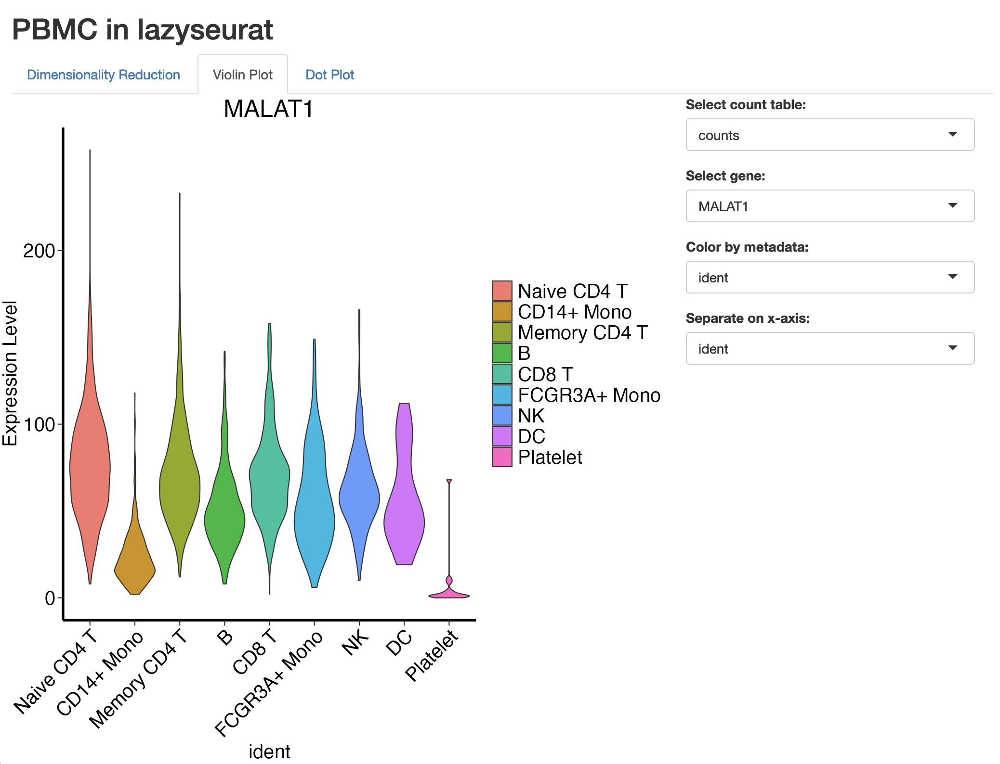
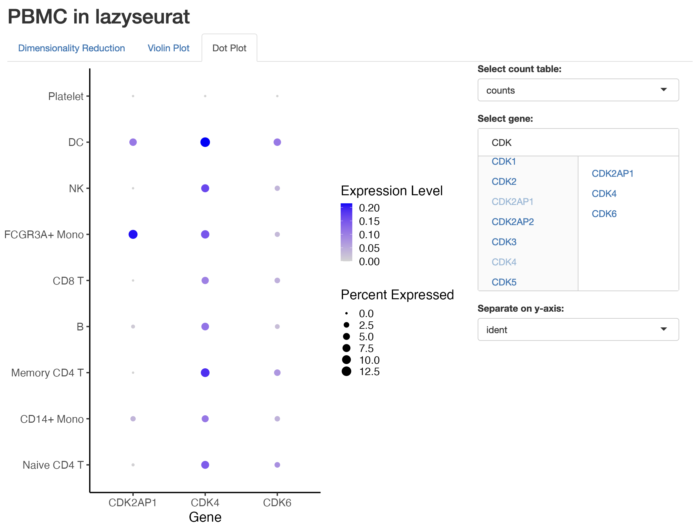

# Shiny template for Seurat object visualization
This Shiny template package uses `lazyseurat` to visualize Seurat objects that have been converted to a `lazyseurat`-compatible DuckDB. It offers three main app panels:
1. Dimensionality reduction: PCA/UMAP plots
2. Violin plot: Gene expression violin plots
3. Dot plot: Gene expression dot plots

## Installation
```r
devtools::install_github("jeskowagner/lazyseurat")
devtools::install_github("jeskowagner/lazyseurat-shiny")
```

## Usage
```r
lazyseuratShiny::runLazySeuratShiny()

# if you would like to use your own data,
# first convert your Seurat object to a lazyseurat-compatible DuckDB
lazyseurat::write_seurat_to_db(seurat_object, "/path/to/your/duckdb")

# then run the Shiny app with the resulting database
lazyseuratShiny::runLazySeuratShiny("/path/to/your/duckdb")
```

**Note:** because the data that ships with `lazyseurat` is very minimal, not all features of the app will work with the default data. For a full experience, use your own data.

## Pictures



